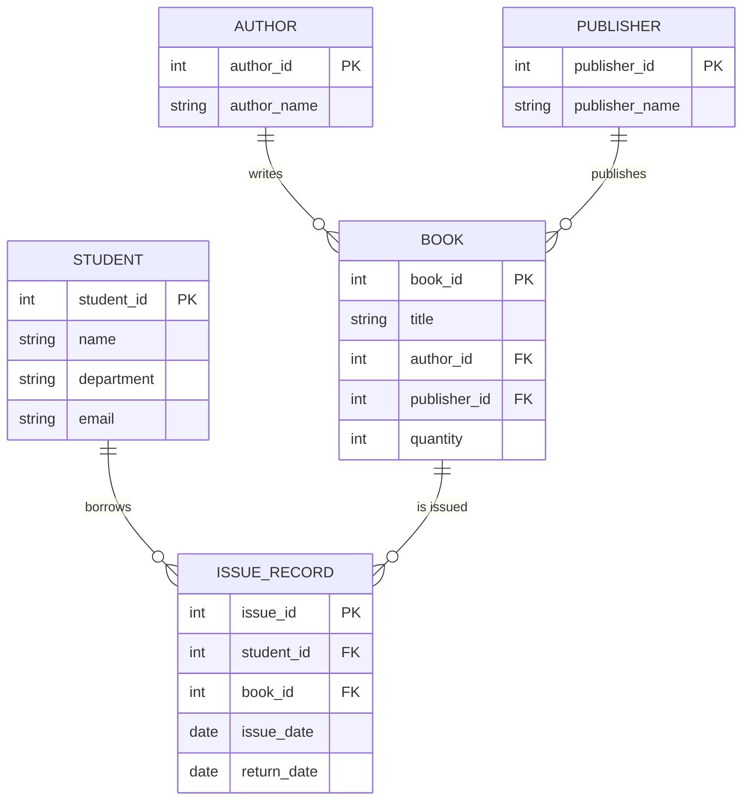

# ER Diagram for Library Management System

```mermaid
erDiagram
    STUDENT ||--o{ ISSUE_RECORD : "borrows"
    BOOK ||--o{ ISSUE_RECORD : "is issued"
    AUTHOR ||--o{ BOOK : "writes"
    PUBLISHER ||--o{ BOOK : "publishes"

    STUDENT {
        int student_id PK
        string name
        string department
        string email
    }

    AUTHOR {
        int author_id PK
        string author_name
    }

    PUBLISHER {
        int publisher_id PK
        string publisher_name
    }

    BOOK {
        int book_id PK
        string title
        int author_id FK
        int publisher_id FK
        int quantity
    }

    ISSUE_RECORD {
        int issue_id PK
        int student_id FK
        int book_id FK
        date issue_date
        date return_date
    }
```
